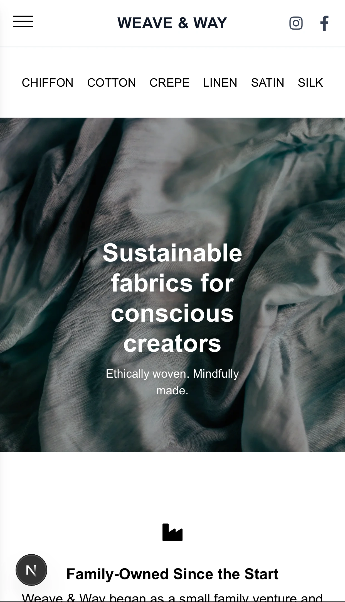

# Weave & Way 🧵

**Weave & Way** is a modern fabric catalog web application that allows users to explore a curated collection of textiles by category and detail. Admins can securely manage the fabric database using a protected dashboard with full CRUD capabilities.

## 

## ✨ Features

- 🔎 Browse fabrics by **category** or **search**
- 📄 View detailed fabric information with name, title, description, and image
- 🔐 **Admin panel** with **authentication**
- ✅ Admin can **Create, Read, Update, Delete** fabrics , upload image , upload json file or add individual fabric
- ⚙️ RESTful API endpoints with **MongoDB + Mongoose**
- 🖼️ Image support for each fabric with dynamic rendering

---

## 🧰 Tech Stack

- **Frontend:** Next.js (App Router), Tailwind CSS
- **Backend/API:** Next.js API Routes (RESTful structure)
- **Database:** MongoDB with Mongoose ODM
- **Auth:** Firebase Authentication or custom token-based protection for admin routes
- **Deployment:** Vercel

---

🔐 Admin Panel
The /admin route is protected and only accessible to authenticated users. Once logged in, admins can:

✏️ Create new fabric entries

📖 Read and filter existing fabrics

🛠️ Update fabric data

🗑️ Delete single or all fabrics

📁 Upload mock data or JSON files

📦 API Endpoints
GET /api/fabrics – Get all fabrics

POST /api/fabrics – Add a new fabric

GET /api/fabrics/:id – Get fabric by ID

PUT /api/fabrics/:id – Update fabric by ID

DELETE /api/fabrics/:id – Delete fabric by ID

GET /api/fabric-categories – Get all fabric categories

🚀 Setup Instructions
Clone the repo
git clone https://github.com/shay122990/weave-way

Install dependencies
npm install

Set up your .env file with:

MONGODB_URI=your_mongodb_connection_string
NEXT_PUBLIC_SITE_URL=your_deployment_url
ADMIN_SECRET=your_admin_password_or_key
JWT_SECRET=your_key

Start the dev server
npm run dev

## 🧑‍💻 Future Improvements

🌍 Category pages with SEO

🔍 Advanced search (material, color, pattern)

📦 User accounts for wishlist or saved fabrics

📬 Contact
Feel free to reach out for feedback or collaboration:

🪡 License
This project is licensed under the MIT License.
